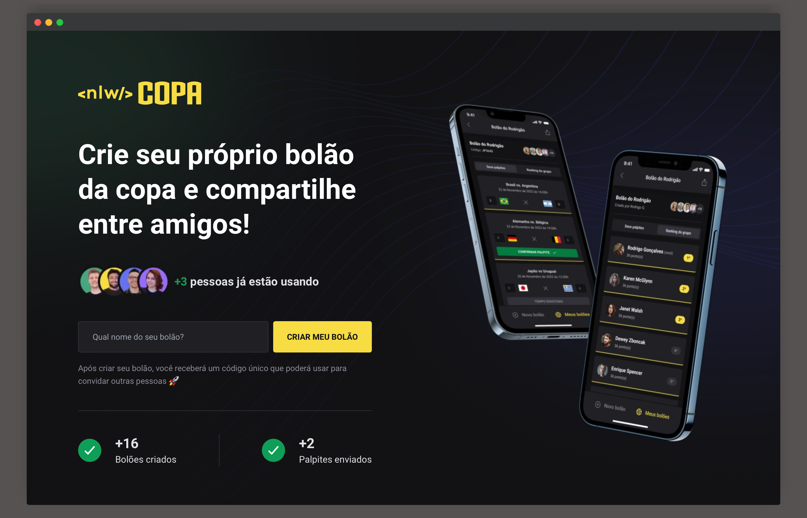

<div id='top'>

# NLW Bolão da Copa - Trilha Ignite | Rocketseat

</div>

<p align="center">
  <a href="#memo-about">About</a> &#xa0; | &#xa0; 
  <!-- <a href="#sparkles-features">Features</a> &#xa0; | &#xa0; -->
  <a href="#white_check_mark-requirements">Requirements</a> &#xa0; | &#xa0;
  <a href="#checkered_flag-starting">Starting</a> &#xa0; | &#xa0;
  <a href="#bookmark-use-cases">Use Cases</a> &#xa0; | &#xa0;
  <a href="#memo-license">License</a> &#xa0; | &#xa0;
  <a href="https://github.com/itzmatheus" target="_blank">Author</a>
</p>


## :memo: About

During the event **NLW Bolão da Copa** we have developed a _web_ and _mobile_ platform where everyone can create a poll, share with other users, their can join and make guesses about the games of world cup 2022. This project is part of the Ignite Trail and we learned about NodeJS with Fastify, React with TypeScript and React Native with Expo.

The web application allows us to create a poll and return a code to share with friends to thei can join using the mobile application. In the mobile application, we can SignIn/SignUp and have access to the application, can create polls, join in a especific poll using the code of that poll, view a list of games from that poll, also can make a guess for the games and see the ranking witch show us who guesses mores polls of the World Cup 2022.

VAI BRAZIL! THE HEXA IS OURSSSS!!!!!

This project was developed during the event **#NLWtogether** hosted by [Rocketseat](https://www.rocketseat.com.br) with the help of the instructors [Diego Fernandes](https://github.com/diego3g) and [Rodrigo Gonçalves](https://github.com/rodrigorgtic).

<!-- prettier-ignore -->
| 🪧 Informations   |     |
| --------------- | --- |
| ✨ Name         | **Web NLW Bolão da Copa** - Rocketseat |
| 🏷️ Technologies  | TypeScript, NextJS, ReactJS, Axios e Tailwindcss |
| 💻 Api version  | [Click here](https://github.com/itzmatheus/nlw-copa-polls-api) |
| 📲 Mobile version | [Click here](https://github.com/itzmatheus/nlw-copa-polls-mobile) |
| 🔥 Design       | [**Figma**](https://www.figma.com/file/Mfwn2yVONCulrbt27qEYhF/Bol%C3%A3o-da-Copa-(Community)?node-id=0%3A1) |

## 🩹 Improvements needed

The project was totally developed according to the instructions given, no aditionals. In the future, it would be interesting to add the following implementations:

- SignIn/SignUp;



## :white_check_mark: Requirements

Before starting 🏁, you need to have [Git](https://git-scm.com) and [Node](https://nodejs.org/en/) v18.12.0 installed.

Suggest: https://github.com/nvm-sh/nvm

## :checkered_flag: Starting

```bash
# Clone this project
$ git clone https://github.com/itzmatheus/nlw-copa-polls-web
# Access
$ cd nlw-copa-polls-web
# Install dependencies
$ npm install
# Run local
$ npm run dev
# The server will initialize in the <http://127.0.0.1:3000/>
```

PS: if you have [make](https://www.cs.swarthmore.edu/~newhall/unixhelp/howto_makefiles.html) installed, consult Makefile to see all commands shortcuts =)

## :bookmark: Use Cases

#### Create poll

User can create a poll, return a code to share with friends;

---

## :memo: License

This project is under license from MIT. For more details, see the [LICENSE](LICENSE) file.


<a href='#top'>🔼 Back to top</a>

---
Developer by [@Matheus Leite](https://itzmatheus.github.io/portfolio/)
